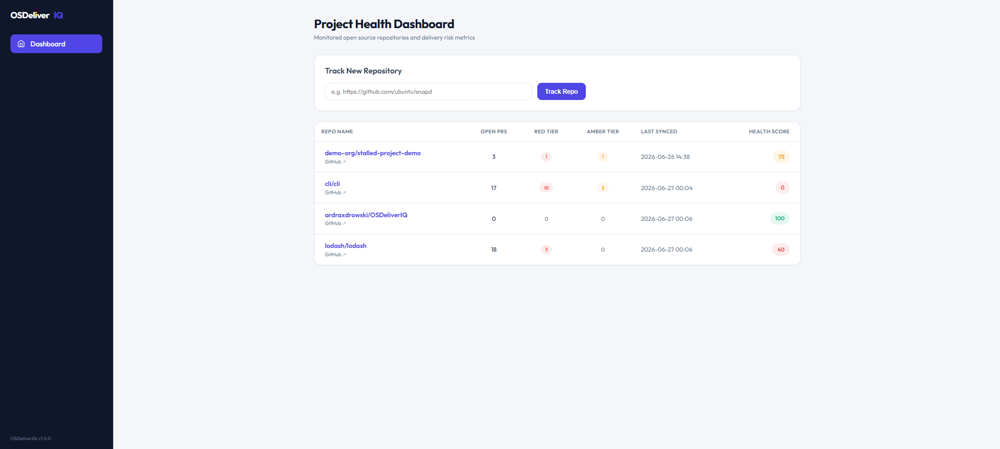
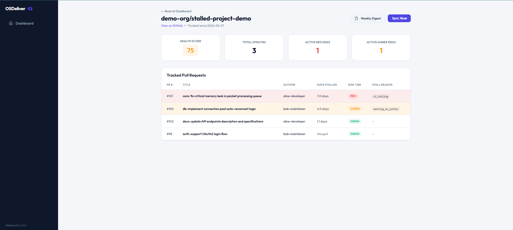
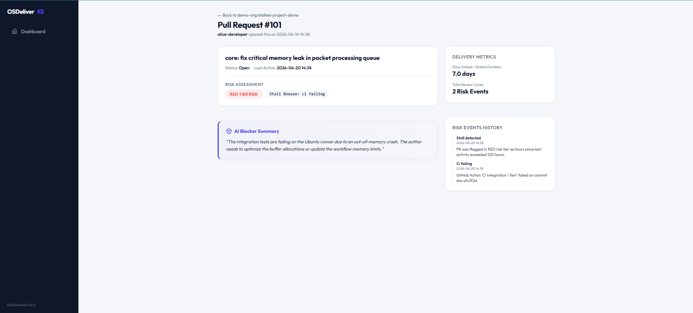
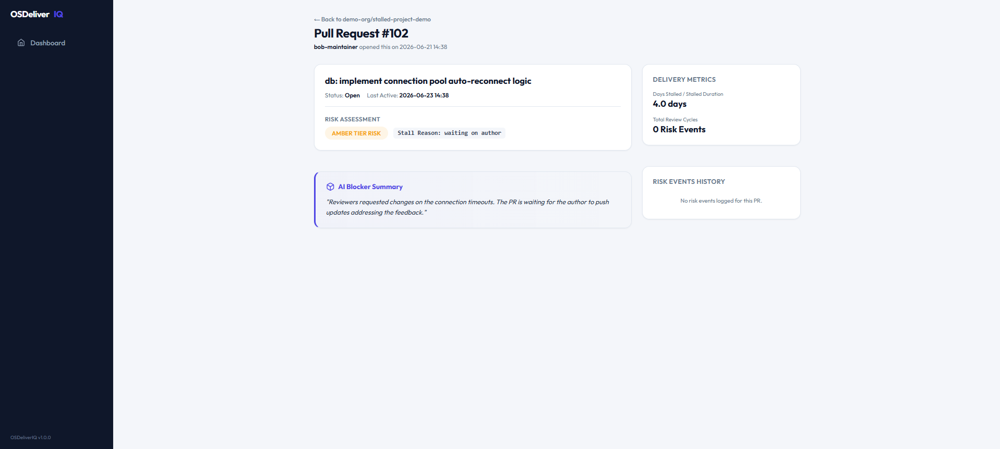
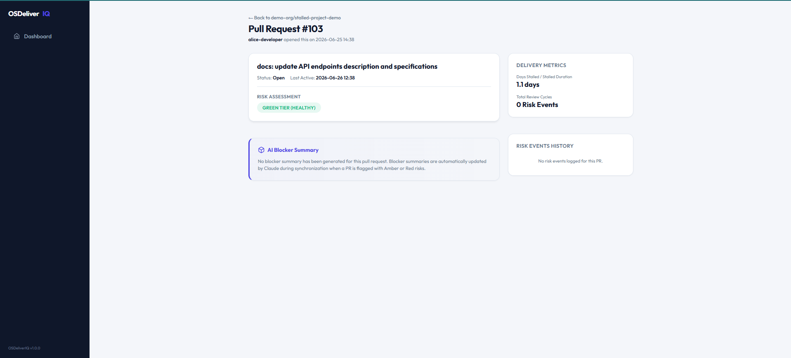
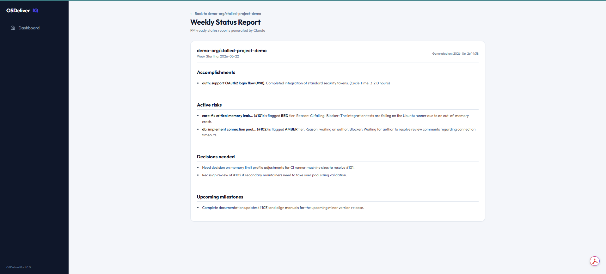
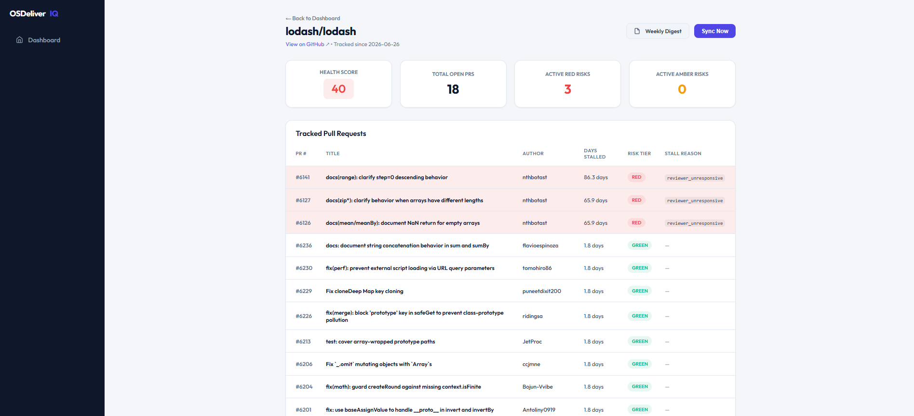
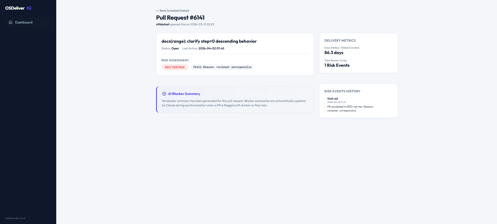
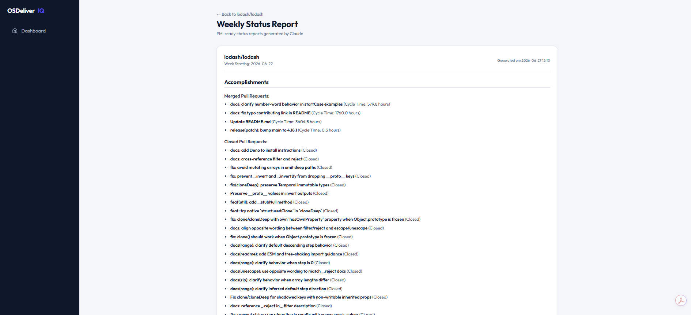

# OSDeliverIQ

OSDeliverIQ is a project health intelligence tool designed specifically for open source repositories. It enables engineering managers, project managers, and maintainers to track delivery risks, calculate contributor velocities, and generate product-manager-ready weekly status reports from repository activity. By monitoring pull requests, active reviewers, and CI/CD statuses, it programmatically surfaces blockers and leverages Anthropic's Claude to distill comment threads into actionable summaries, keeping distributed engineering teams aligned without manual overhead.

---

## Technical Stack

| Dependency | Purpose | Choice Rationale |
| :--- | :--- | :--- |
| **Python 3.11** | Runtime environment | Stability, typing support, and modern async libraries. |
| **FastAPI** | Web framework & API | Async routing, auto-generated documentation, and performance. |
| **PostgreSQL** | Relational database | Robust persistence, JSONB capabilities, and ACID compliance. |
| **SQLAlchemy 2.0** | Async ORM | Modernized Pythonic interface, type safety, and async support. |
| **APScheduler** | Background scheduler | In-process cron and interval scheduling without heavy message queues. |
| **HTTPX** | Async HTTP Client | Non-blocking, modern async HTTP interface for GitHub API calls. |
| **Jinja2** | HTML templating | High-performance template rendering for simple server-side UI. |
| **Anthropic SDK** | AI interface | Simple Python client for Claude models to perform smart summaries. |
| **Docker & Compose** | Containerisation | Simplified dependency orchestration (app + database) for dev and prod. |

---

## Architecture Overview

OSDeliverIQ uses a clean, data-driven architecture that separates ingestion, analytical scoring, and user-facing delivery.
1. **Ingestion Layer**: Triggered periodically or on-demand, an async scheduler queries the GitHub REST API using `httpx`. The fetched payloads (pull requests, reviews, comments, and statuses) are converted into relational records using normalized models.
2. **Analytics & Risk Engine**: Evaluates the last activity timestamps of open pull requests and classifies them into risk tiers (Green, Amber, Red). It analyzes review counts, responsive activity, and check runs to identify specific stall reasons.
3. **AI Layer**: Calls Claude 3.5 Sonnet to generate 2-sentence blocker summaries for at-risk PRs and weekly status reports mapping achievements, risks, decisions, and milestones.
4. **Presentation Layer**: A lightweight server-side rendered FastAPI dashboard built using Jinja2 templates displays tracked repositories, their health scores, and PR-specific drill-downs.

---

## Quick Start

### Prerequisites
- Python 3.11+ (if running bare-metal)
- Docker & Docker Compose

### Running the App
1. **Clone the Repository** and navigate to the project directory:
   ```bash
   git clone https://github.com/your-org/osdeliveriq.git
   cd osdeliveriq
   ```

2. **Configure Environment Variables**:
   Copy the example file and edit it with your GitHub Personal Access Token (PAT) and Anthropic API key:
   ```bash
   cp .env.example .env
   ```
   *Note: Set your `GITHUB_TOKEN` and `ANTHROPIC_API_KEY` in the newly created `.env` file.*

3. **Orchestrate Services**:
   Spin up the application and PostgreSQL database containers:
   ```bash
   docker-compose up --build
   ```

4. **Access the Dashboard**:
   Open [http://localhost:8000](http://localhost:8000) in your web browser.

---

## Tracking a Repository
1. On the main Dashboard page, navigate to the **Track New Repository** card.
2. Paste the full GitHub URL of the repository (e.g., `https://github.com/canonical/netplan`).
3. Click **Track Repo**. The application will register the repository, parse its owner and name, and trigger an immediate ingestion and risk-evaluation sweep.

---

## Environment Variables

| Variable | Description | Default Value |
| :--- | :--- | :--- |
| `GITHUB_TOKEN` | GitHub Personal Access Token (PAT) to authorize API requests and avoid rate limits. | *Required* |
| `ANTHROPIC_API_KEY` | Anthropic API Key used to query Claude. | *Required for AI features* |
| `DATABASE_URL` | SQLAlchemy-compatible async connection string for PostgreSQL. | `postgresql+asyncpg://postgres:password@db:5432/osdeliveriq` |
| `POLL_INTERVAL_MINUTES` | Frequency (in minutes) at which background syncs pull from GitHub. | `30` |
| `STALL_RED_HOURS` | Number of hours without PR activity before marking it as Red risk. | `120` (5 days) |
| `STALL_AMBER_HOURS` | Number of hours without PR activity before marking it as Amber risk. | `48` (2 days) |

---

## Running Tests Locally
To execute the pytest suite locally, ensure you have set up a virtual environment and installed the dependencies:
```bash
# Setup virtual environment
python -m venv .venv
source .venv/bin/activate  # On Windows use: .venv\Scripts\activate

# Install dependencies
pip install -r requirements.txt

# Run the tests
python -m pytest
```

---

## Design Decisions

- **APScheduler over Celery**: Celery requires a message broker like Redis or RabbitMQ. APScheduler runs in-process inside the FastAPI application, eliminating separate broker dependencies, reducing deployment complexity, and minimizing costs.
- **LLM in Only 2 Places**: AI features should be precise and applied where humans struggle to scale (summarizing long discussion threads and drafting weekly logs). We avoid speculative or hype-driven AI additions, keeping core metrics (cycle time, risks, load) deterministic and verifiable.
- **FastAPI + Jinja2 over React**: This is a PM-facing dashboard that needs to load fast and remain maintainable. By rendering HTML on the server, we eliminate React build steps, CORS headers, state management libraries, and NPM vulnerability cycles.

## Screenshots

### Project Health Dashboard
Tracking multiple real-world repositories with live health scores and risk tier counts.


### Repository Detail — cli/cli
17 open PRs with 10 RED tier and 3 AMBER tier risks detected across Microsoft's CLI repo.


### Pull Request Detail — RED Tier with AI Blocker Summary
PR stalled 7 days, CI failing. Claude generates a 2-sentence blocker summary automatically.


### Pull Request Detail — AMBER Tier
PR flagged as waiting on author after reviewer requested changes.


### Pull Request Detail — GREEN Tier
Healthy PR with no blocker summary generated (correct behaviour — AI only activates on risk).


### Weekly Status Report — demo repo
Auto-generated PM-ready digest with accomplishments, active risks, decisions needed, and milestones.


### Repository Detail — ardraxdrowski/OSDeliverIQ
The tool monitoring itself. Health score 100, no open PRs.


### Repository Detail — lodash/lodash
18 open PRs, 3 RED tier risks detected on real open source repository.


### Pull Request Detail — lodash PR stalled 86 days
Real lodash PR with 86 days of inactivity, reviewer unresponsive, risk event history logged.


### Weekly Status Report — lodash/lodash
Full digest generated from real lodash repository activity including merged and closed PRs.
